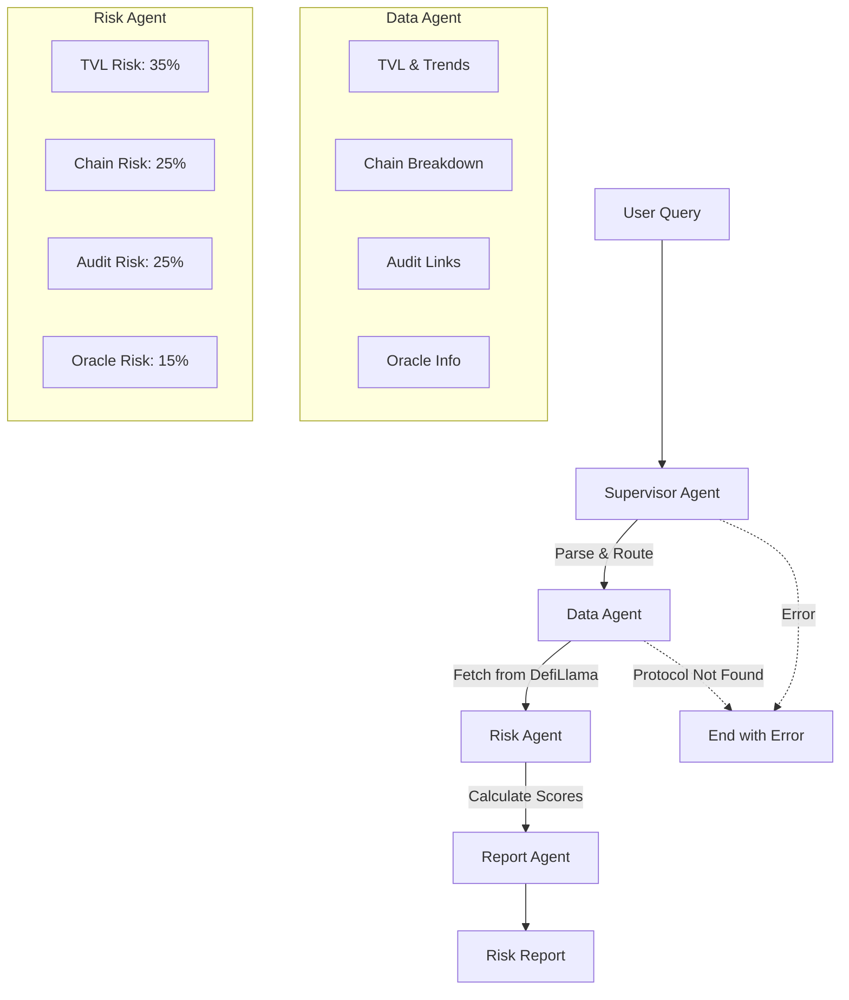
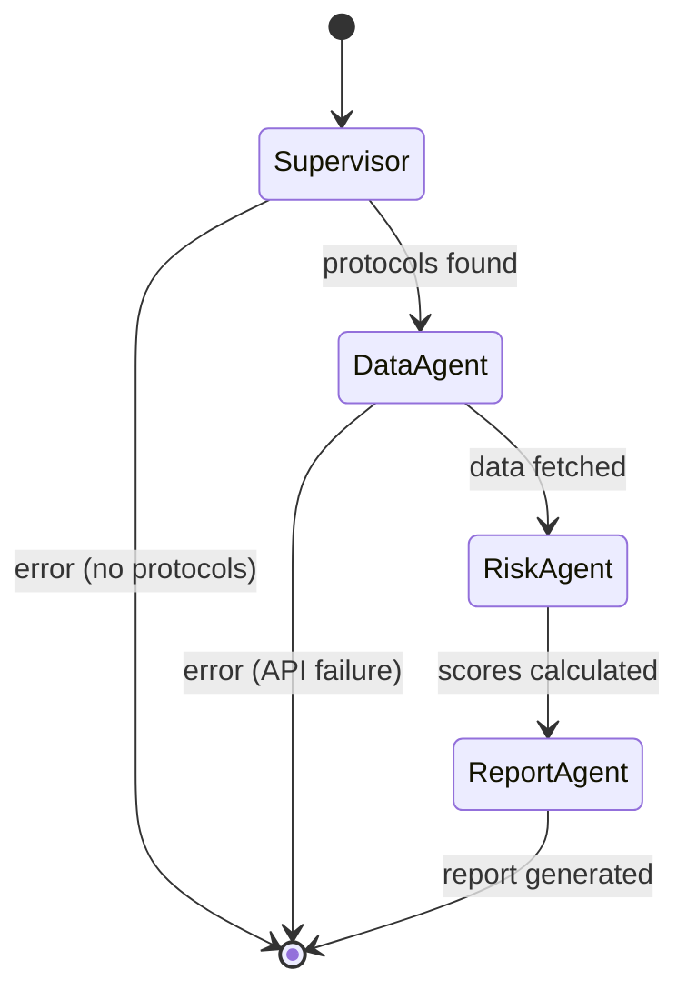
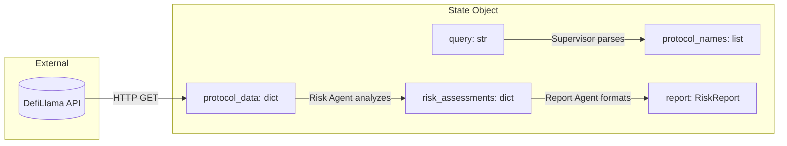
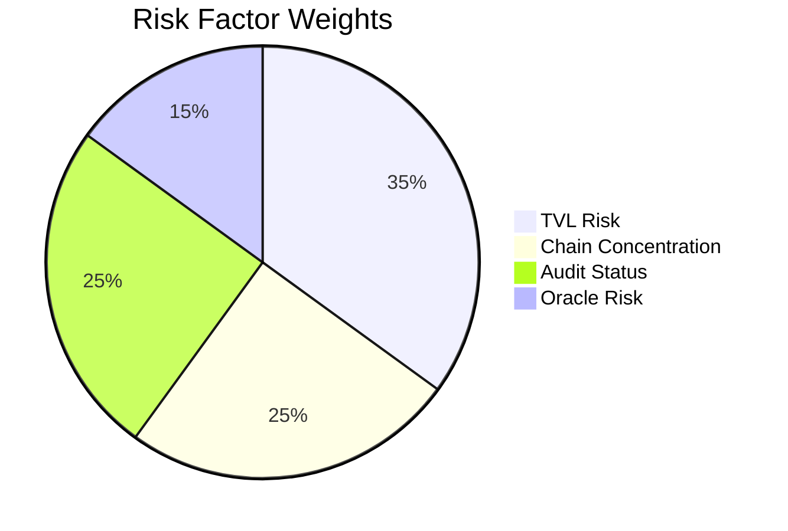
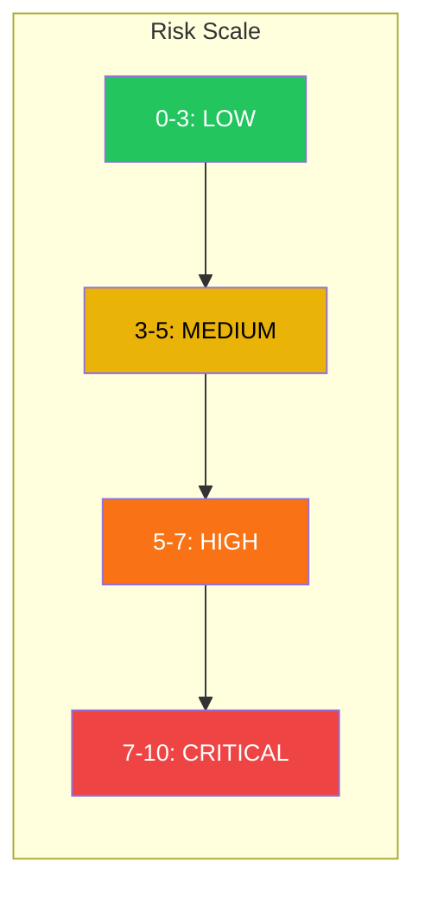
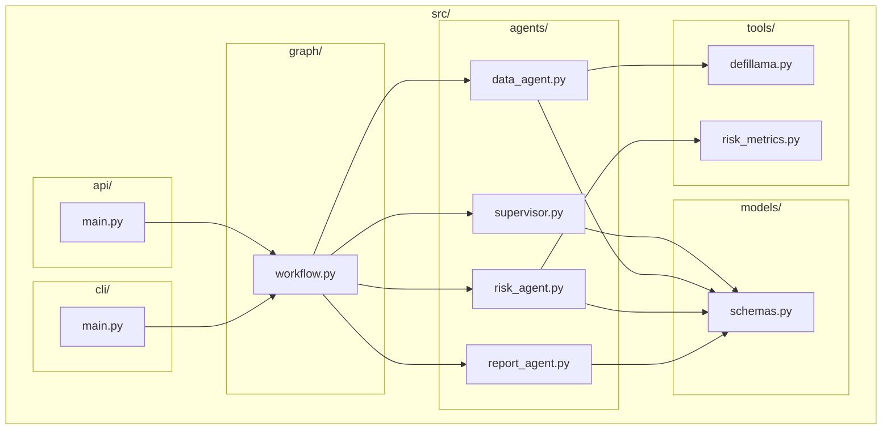

# DeFi Risk Analysis Agent

A multi-agent system built with LangGraph that analyzes DeFi protocol risk using on-chain data from DefiLlama.

## The Problem

Decentralized Finance (DeFi) protocols manage billions of dollars in user funds, yet assessing their risk remains challenging:

1. **Information Fragmentation** - Protocol data is scattered across multiple sources (on-chain data, audit reports, documentation, social channels)
2. **No Standardized Risk Framework** - Unlike traditional finance, DeFi lacks consistent risk rating methodologies
3. **Rapid Evolution** - New protocols launch daily; TVL and chain deployments change constantly
4. **Technical Complexity** - Understanding smart contract risk requires specialized knowledge

Investors, institutions, and developers need a systematic way to evaluate protocol risk before allocating capital or building integrations.

## The Solution

This project provides an automated risk analysis pipeline that:

- Aggregates protocol data from DefiLlama (TVL, chain distribution, audit status)
- Applies a quantitative risk scoring methodology across multiple dimensions
- Generates professional reports with clear explanations and data provenance
- Exposes results via CLI, REST API, and Python library

The multi-agent architecture allows each component to specialize in its domain while the supervisor coordinates the overall workflow.

## How It Works

### Architecture



### Agent Responsibilities

| Agent | Role | Input | Output |
|-------|------|-------|--------|
| **Supervisor** | Query parsing, workflow routing | User query string | Protocol names, workflow intent |
| **Data Agent** | External data fetching | Protocol names | `ProtocolData` objects |
| **Risk Agent** | Risk score calculation | Protocol data | `RiskAssessment` objects |
| **Report Agent** | Report generation | Data + Assessments | Formatted `RiskReport` |

### LangGraph Workflow

The agents are orchestrated using [LangGraph](https://github.com/langchain-ai/langgraph), a framework for building stateful, multi-step AI applications. The workflow is defined as a directed graph:



**Key concepts:**

- **Nodes** are agent functions that process and transform state
- **Edges** define transitions between agents (including conditional routing)
- **State** is a typed dictionary that accumulates data as it flows through the graph

```python
# Simplified workflow definition
workflow = StateGraph(WorkflowState)
workflow.add_node("supervisor", supervisor.run)
workflow.add_node("data_agent", data_agent.run)
workflow.add_node("risk_agent", risk_agent.run)
workflow.add_node("report_agent", report_agent.run)

workflow.set_entry_point("supervisor")
workflow.add_conditional_edges("supervisor", route_next_agent, {...})
workflow.add_conditional_edges("data_agent", route_next_agent, {...})
workflow.add_conditional_edges("risk_agent", route_next_agent, {...})
workflow.add_edge("report_agent", END)
```

This design enables:
- Clear separation of concerns
- Easy addition of new agents
- Debuggable state at each step
- Potential for human-in-the-loop interventions

### Data Flow



## Risk Assessment Methodology

### Scoring Model

Risk is scored on a 0-10 scale where **lower scores indicate lower risk**. The overall score is a weighted average of four factors:



| Factor | Weight | What It Measures |
|--------|--------|------------------|
| **TVL Risk** | 35% | Protocol size, volatility, and 30-day trend |
| **Chain Concentration** | 25% | Diversification across blockchains |
| **Audit Status** | 25% | Presence and number of security audits |
| **Oracle Risk** | 15% | Dependency on price oracles |

### Factor Details

#### TVL Risk (35%)

Evaluates Total Value Locked as a proxy for protocol maturity and market confidence.

| Metric | Low Risk | Medium Risk | High Risk |
|--------|----------|-------------|-----------|
| TVL Size | > $1B | $100M - $1B | < $100M |
| Volatility (CV) | < 10% | 10-25% | > 25% |
| 30-day Trend | Growing > 10% | Stable ±10% | Declining > 10% |

#### Chain Concentration (25%)

Measures diversification using the Herfindahl-Hirschman Index (HHI). Single-chain protocols face higher risk from chain-specific issues (outages, exploits, regulatory action).

| Distribution | Risk Level |
|--------------|------------|
| Top chain < 50% TVL | Low |
| Top chain 50-80% TVL | Medium |
| Top chain > 80% TVL | High |
| 5+ chains with meaningful TVL | Bonus reduction |

#### Audit Status (25%)

Checks for security audit records in DefiLlama metadata.

| Status | Score |
|--------|-------|
| 3+ audits on record | 2.0 (Low) |
| 1-2 audits | 4.0 (Medium) |
| No audits found | 8.0 (High) |

#### Oracle Risk (15%)

Evaluates dependency on external price feeds.

| Oracle Usage | Score |
|--------------|-------|
| Chainlink, Pyth, or other trusted oracles | 2.0 |
| Unknown or custom oracles | 5.0 |
| No oracle dependency detected | 4.0 |

### Risk Levels



| Level | Score Range | Interpretation |
|-------|-------------|----------------|
| **Low** | 0 - 3 | Well-established protocol with strong fundamentals |
| **Medium** | 3 - 5 | Moderate risk factors; standard due diligence recommended |
| **High** | 5 - 7 | Significant concerns; requires careful evaluation |
| **Critical** | 7 - 10 | Multiple high-risk factors; proceed with caution |

## Installation

### Using Nix (Recommended)

```bash
git clone https://github.com/Ricoledan/defi-risk-agent.git
cd defi-risk-agent

# Enter development shell (installs Python 3.11 + dependencies)
nix develop

# Or with direnv
direnv allow
```

### Using pip

```bash
git clone https://github.com/Ricoledan/defi-risk-agent.git
cd defi-risk-agent

# Create virtual environment
python3.11 -m venv .venv
source .venv/bin/activate

# Install package
pip install -e .

# With development dependencies
pip install -e ".[dev]"
```

### LLM Setup (Optional)

For AI-powered insights, install and run Ollama:

```bash
# macOS
brew install ollama

# Or use the setup script
./scripts/setup-ollama.sh

# Start Ollama server
ollama serve

# Pull the default model (in another terminal)
ollama pull llama3.2
```

You can also use OpenAI or Anthropic by setting environment variables:

```bash
# For OpenAI
export LLM_PROVIDER=openai
export OPENAI_API_KEY=your-key

# For Anthropic
export LLM_PROVIDER=anthropic
export ANTHROPIC_API_KEY=your-key
```

## Usage

### CLI

```bash
# Analyze a single protocol
defi-risk analyze aave

# With AI-powered insights (requires Ollama)
defi-risk analyze aave --llm

# Output as JSON
defi-risk analyze aave --json

# Compare multiple protocols
defi-risk compare aave compound

# Compare with AI insights
defi-risk compare aave compound --llm

# List top protocols by TVL
defi-risk protocols

# Natural language query
defi-risk query "analyze uniswap risk"

# Check LLM setup status
defi-risk setup-llm
```

### REST API

```bash
# Start server
uvicorn src.api.main:app --reload

# Health check
curl http://localhost:8000/health

# Analyze protocol
curl -X POST http://localhost:8000/analyze/aave

# Compare protocols
curl -X POST http://localhost:8000/compare \
  -H "Content-Type: application/json" \
  -d '{"protocols": ["aave", "compound"]}'

# List protocols
curl "http://localhost:8000/protocols?limit=20"
```

### Python Library

```python
import asyncio
from src.graph.workflow import DeFiRiskWorkflow

async def main():
    workflow = DeFiRiskWorkflow()

    # Single protocol analysis
    report = await workflow.analyze("aave")
    print(f"Risk Level: {report.assessment.score.level}")
    print(f"Score: {report.assessment.score.overall}/10")

    # Protocol comparison
    comparison = await workflow.compare(["aave", "compound", "maker"])
    print(comparison.recommendation)

asyncio.run(main())
```

## Example Output

```
$ defi-risk analyze aave

# DeFi Risk Report: Aave V3

Generated: 2024-01-15 14:30 UTC

## Executive Summary

Aave V3 is a Lending protocol with $28.03B in Total Value Locked across 18 blockchains.

**Risk Assessment:** MEDIUM (Score: 4.1/10)

**Key Findings:**
- Well-diversified across 18 chains
- 1 security audit(s) on record

## Risk Score Breakdown

### TVL Risk: 3.2/10
Large TVL ($28.03B) indicates maturity. Low volatility (4.7%). Stable trends.

### Chain Concentration: 5.5/10
18 chains | Top: Ethereum: 81.5%, Arbitrum: 3.0%, Base: 2.7%
High concentration on Ethereum despite multi-chain presence.

### Audit Status: 4.0/10
Audited (1 audit). Has security audit(s) on record.

### Oracle Risk: 4.0/10
No oracle dependency detected in metadata.

---

_Data source: DefiLlama API (https://defillama.com)_
```

## Project Structure



```
defi-risk-agent/
├── src/
│   ├── agents/
│   │   ├── supervisor.py      # Query parsing, workflow routing
│   │   ├── data_agent.py      # DefiLlama data fetching
│   │   ├── risk_agent.py      # Risk score calculation
│   │   └── report_agent.py    # Report generation
│   ├── graph/
│   │   └── workflow.py        # LangGraph StateGraph definition
│   ├── tools/
│   │   ├── defillama.py       # DefiLlama API client with caching
│   │   └── risk_metrics.py    # Risk calculation algorithms
│   ├── models/
│   │   └── schemas.py         # Pydantic models for all data types
│   ├── api/
│   │   └── main.py            # FastAPI application
│   └── cli/
│       └── main.py            # Typer CLI application
├── tests/                     # 48 unit/integration tests
├── flake.nix                  # Nix flake for reproducible dev env
├── pyproject.toml             # Python package configuration
└── README.md
```

## Technology Stack

| Component | Technology | Purpose |
|-----------|------------|---------|
| Agent Orchestration | LangGraph | Stateful multi-agent workflow |
| LLM (Optional) | Ollama / OpenAI / Anthropic | AI-powered insights |
| Data Validation | Pydantic | Type-safe data models |
| HTTP Client | httpx | Async API requests |
| REST API | FastAPI | Web API endpoints |
| CLI | Typer + Rich | Command-line interface |
| Testing | pytest + pytest-asyncio | Async test support |
| Linting | Ruff | Fast Python linter |
| Dev Environment | Nix | Reproducible builds |

## Data Source

All protocol data is fetched from the [DefiLlama API](https://defillama.com/docs/api):

| Endpoint | Data Retrieved |
|----------|----------------|
| `/protocols` | Protocol list with current TVL, category, chains |
| `/protocol/{name}` | Historical TVL, chain breakdown, audit links, oracles |

DefiLlama aggregates on-chain data across 200+ blockchains and 3000+ protocols. Data is typically updated every few minutes.

## Limitations

This tool has significant limitations that users should understand:

### Data Limitations

- **Single Data Source** - Relies entirely on DefiLlama. If their data is incomplete, stale, or incorrect, our analysis will be too.
- **Audit Data Quality** - DefiLlama's audit links are community-maintained and may be incomplete. A protocol showing "no audits" may actually have audits that aren't indexed.
- **No Historical Incidents** - The system does not track past exploits, hacks, or security incidents. A protocol with a history of exploits will not be penalized.
- **No Smart Contract Analysis** - We don't analyze actual smart contract code, only metadata about the protocol.

### Methodology Limitations

- **Simplified Risk Model** - Real DeFi risk assessment requires analyzing tokenomics, governance, team, code quality, economic attacks, and more. Our four-factor model is a simplification.
- **Arbitrary Weights** - The 35/25/25/15 weighting is a reasonable starting point but not empirically validated.
- **TVL as Proxy** - High TVL doesn't guarantee safety (see Terra/Luna). Low TVL doesn't mean a protocol is risky.
- **Chain Concentration** - Multi-chain isn't always better. It can mean more attack surface and bridge risks.

### Technical Limitations

- **No Real-time Data** - Results are cached for 5 minutes. Not suitable for time-sensitive decisions.
- **Optional LLM Integration** - LLM-powered insights require a locally running Ollama server. The base analysis is purely algorithmic.
- **Limited Protocol Recognition** - The supervisor uses keyword matching to find protocols. Unusual names may not be recognized.

### Not Financial Advice

This tool is for educational and research purposes. Risk scores should not be the sole basis for investment decisions. Always:
- Conduct your own research
- Review audit reports directly
- Understand the protocol's mechanics
- Consider risks not captured by this model
- Consult qualified financial advisors for investment decisions

## Development

```bash
# Run all tests
pytest

# Run with coverage
pytest --cov=src

# Linting
ruff check src/ tests/

# Auto-fix lint issues
ruff check src/ tests/ --fix

# Format code
ruff format src/ tests/
```

## Future Improvements

Potential enhancements (not currently implemented):

- [ ] Integrate historical exploit/incident data
- [x] ~~Add LLM-powered analysis for qualitative factors~~ (Added via Ollama integration)
- [ ] Support more data sources (DeFi Safety, Exponential, etc.)
- [ ] Track risk score changes over time
- [ ] Add governance and tokenomics analysis
- [ ] WebSocket support for real-time updates
- [ ] User-configurable risk weights

## License

MIT

## Contributing

Contributions welcome. Please open an issue to discuss significant changes before submitting a PR.
